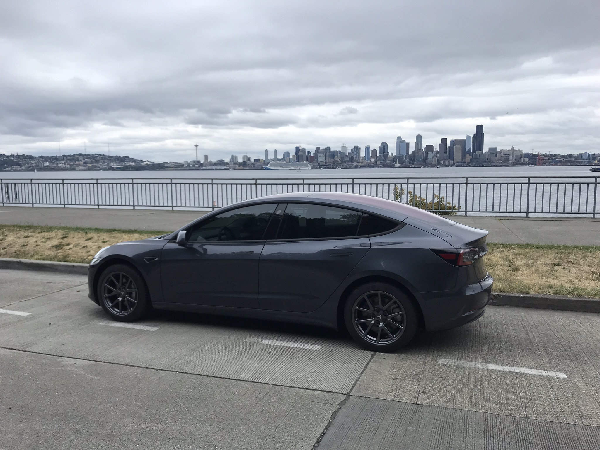
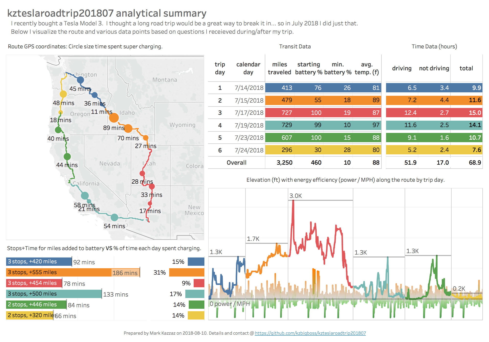
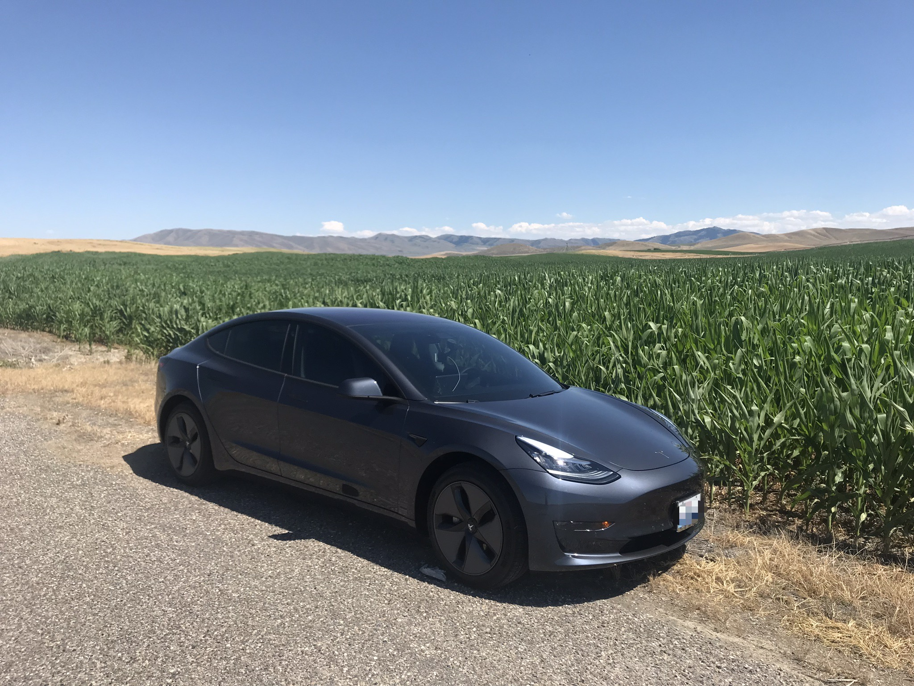
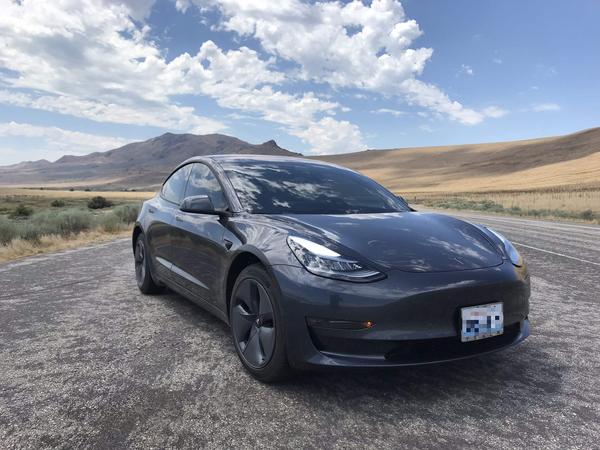
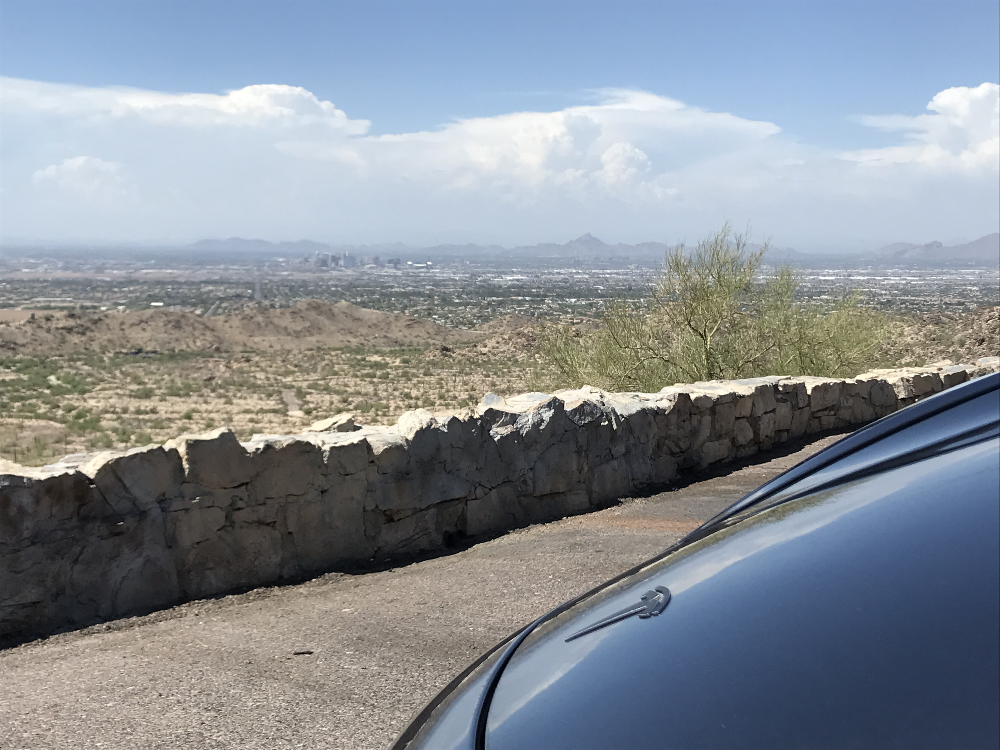
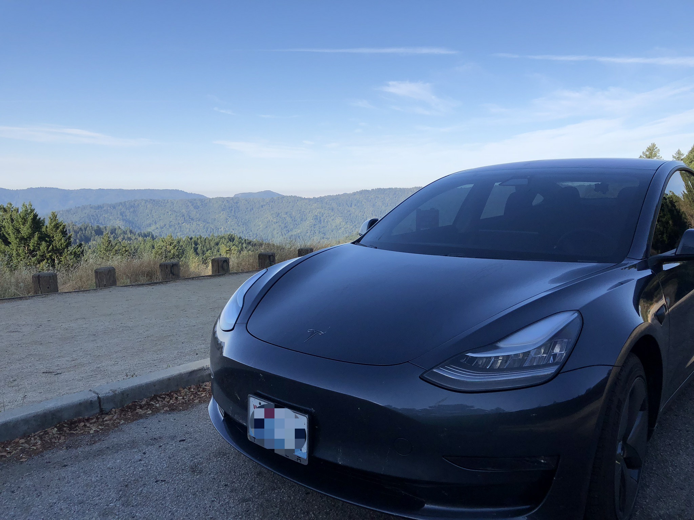
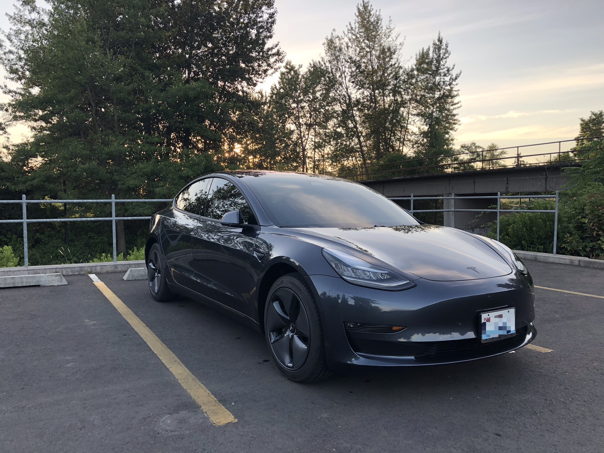
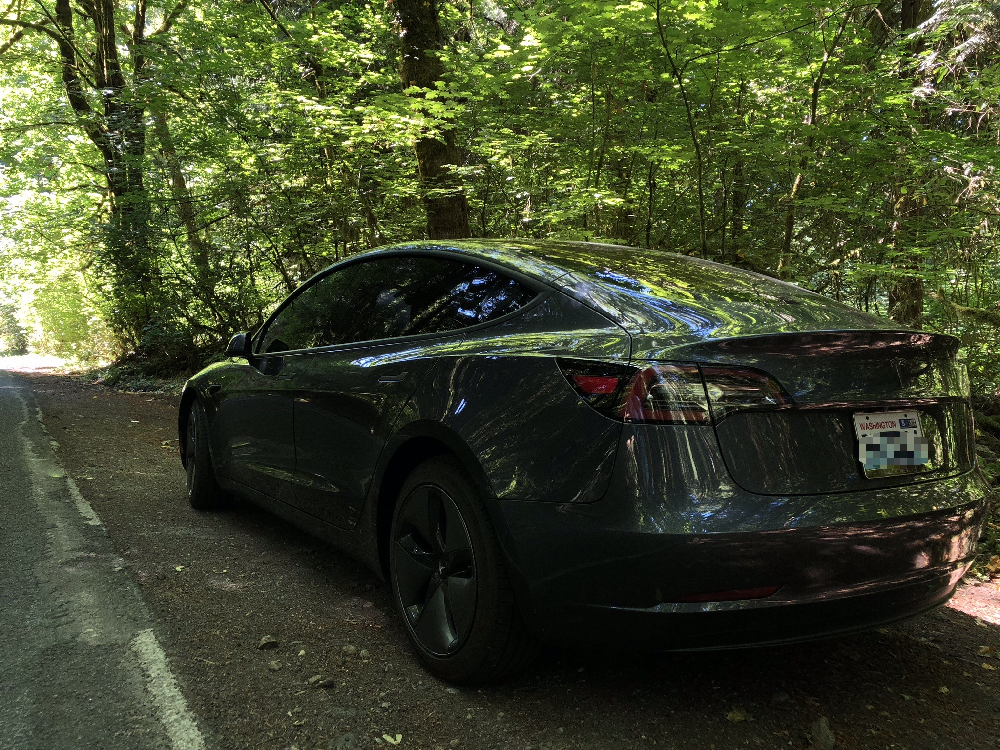

# kzteslaroadtrip201807
A 3.2k mile road trip covering the Western US during July 2018 in a Tesla Model 3.  This GitHub README page focuses on my data analysis of the trip.  For my other silly antics, check out [my related WordPress blog](https://kzroadtrip.wordpress.com/).

<!-- TOC depthFrom:1 depthTo:6 withLinks:1 updateOnSave:1 orderedList:0 -->

- [kzteslaroadtrip201807](#kzteslaroadtrip201807)
	- [Previous analysis](#previous-analysis)
	- [A new ride](#a-new-ride)
	- [Data data data](#data-data-data)
		- [Capturing data](#capturing-data)
		- [Wrangling data](#wrangling-data)
		- [Visualizing data](#visualizing-data)
	- [Analysis results](#analysis-results)
		- [Road trip basics](#road-trip-basics)
		- [Summary dashboard](#summary-dashboard)
		- [Analytics takeaways](#analytics-takeaways)
	- [Scenic photos from each state](#scenic-photos-from-each-state)
		- [Idaho: American Falls](#idaho-american-falls)
		- [Utah: Antelope Island](#utah-antelope-island)
		- [Arizona: South Mountain](#arizona-south-mountain)
		- [California: Castle Rock State Park](#california-castle-rock-state-park)
		- [Oregon: University of Oregon](#oregon-university-of-oregon)
		- [Washington: Priest Point Park](#washington-priest-point-park)

<!-- /TOC -->

## Previous analysis
Back in January 2018, I drove with my brother from Chicago to Cupertino in his Tesla Model S P100D.  Here's a [link](https://github.com/kzbigboss/kzteslaroadtrip2018) to the previous write up.  Knowing how fun it was to road trip in a Tesla, I figured I'd be doing it again some time.

## A new ride
For this road trip, I ended up getting my own Tesla: a grey Model 3 affectionately named Nebula.  I did a little custom work including popping on wheel caps, having the chrome deleted with a matte black finish, and putting on carbon tints across all windows.  She's pretty:

## Data data data

### Capturing data
In my previous write up, I leveraged [Tim Dorr's unofficial Tesla API write up](https://timdorr.docs.apiary.io/#) as well as [DoctorMcKay's JS Node app](https://github.com/DoctorMcKay/node-tesla-data) hosted on AWS.  I oversized both the EC2 and RDS instances and ended up with a $40.00 bill.  Oops.  This time, I ended up using [TeslaFi](www.teslafi.com) to ping the Tesla API while I was driving.  While TeslaFi provides a collection of built in reporting, it still lets you download the raw API responses so I could craft my own story.

### Wrangling data
I took to R to work the data into something for analysis and visualizations.  You can see my [read and clean R script](/scripts/readandclean.R) to see how I worked the data.  It basically consisted of dplyr and some last observation carried forward (LOCF) functions to take care of missing values.  Unfortunately the API doesn't always respond with data so I had to deal with missing values to make the visualizations look good.  Such is the consequence of working with an unsupported API.

### Visualizing data
I'm still using Tableau for my visualization needs.  After I wrangled the data in R, I created several worksheets and smashed them together into a single dashboard.  Even with all the work in R, I still made use of data blending and level of detail calculations for some final tweaks to get labels/facts the way I wanted them to look.

## Analysis results

### Road trip basics
I drove in a big 3.2k mile circle across the Western US states.  I was out for 11 days between 2018-07-14 thru 2018-07-24.  Not every day was a transit day; only six days were dedicated to trekking across states.  The other five nights I spent catching up with friends and checking out the sights across Salt Lake City, Phoenix, and San Jose.

### Summary dashboard
Here's my main Tableau dashboard explaining my trip:

### Analytics takeaways
* Starting off the day with a full charge really helps.
  * Maybe it's part mental, but starting the day with a 3+ hour stretch of driving helped make the drive time fly by.  I wasn't able to charge overnight which meant I needed to stop for a full charge early on Trip Day 2.  Hence, 31% of my travel time that day was spent charging.
  * It's fair to call out that Trip Day 6 also started with a low battery, but that leg of the trip only had to cover < 300 miles.  As a result, I didn't need to start the day with a full charge.
* I spent a lot more time not driving than I thought I did.
  * It felt like time moved at double the speed when I stopped to charging/eating/resting.  
  * Of the 69 hours clocked on trip days, 17 hours (24%) of the time was spent not driving.  Charging was significant majority of this time (11.3 hours, 70%).
* I didn't see any evidence that elevation gains consume materially more power.
  * The visualization I crafted comparing elevation against power efficiency (power divided by MPH) didn't show any strong hints that increases in elevation cost more power for the same mile per hour speed.  I was expecting that the power necessary to move the car at 70 MPH would cost more when increasing to 3k ft elevation than it would increasing to 1k ft elevation.  
  * Instead the only time you see power/MPH surge is in the middle of Trip Day 3.  This was the result of me driving on highways instead of interstates when cruising from Salt Lake City to Phoenix.  On a few occasions I got stuck behind large and slow vehicles... so it was the perfect time to test out Nebula's instant acceleration.

## Scenic photos from each state

I crossed a lot of states in this road trip.  Here's a fun car photo from each state.

### Idaho: American Falls

### Utah: Antelope Island

### Arizona: South Mountain

### California: Castle Rock State Park

### Oregon: University of Oregon

### Washington: Priest Point Park

